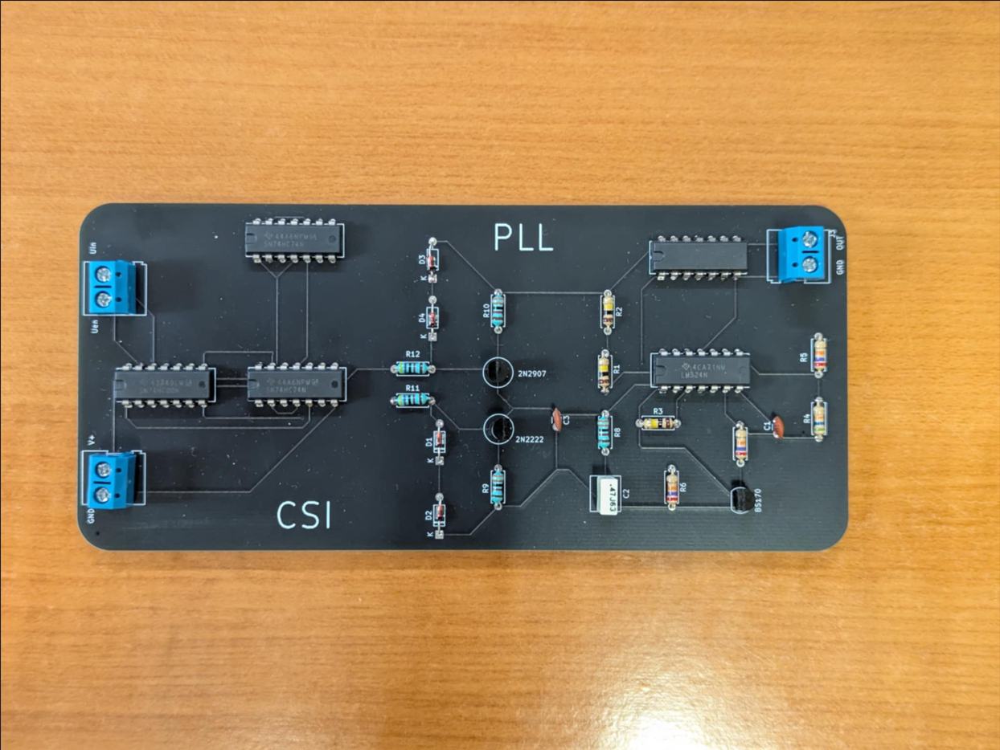

# Analog System Design

This directory contains the course project for Analog System Design, focused on designing and implementing a Phase-Locked Loop (PLL) system.

## Contents

### Project Overview

Design and implementation of a complete PLL (Phase-Locked Loop) circuit, including:

- VCO (Voltage-Controlled Oscillator) design
- Phase detector implementation
- Loop filter design
- Complete PLL system integration

**Partners:** Chronopoulos Stefanos, Gougousi Ioanna

Simulations (`simulations/`)

LTspice simulation files for circuit analysis and verification:

- VCO simulations and small-signal analysis
- Complete PLL system simulations
- Parametric sweeps and performance analysis
- Simulation logs and results documentation

### PCB Design (`PCB/`)

KiCad PCB design files for physical implementation:

- Custom component footprints for ICs (74HC00, 74HC14, 74HCT74, LM324) and transistors (2N2222, 2N2907)
- Schematic symbols library
- PCB layouts (prototype and final with switch)
- SPICE models for circuit simulation in KiCad

### Documentation

- **`report.pdf`**: Final project report
